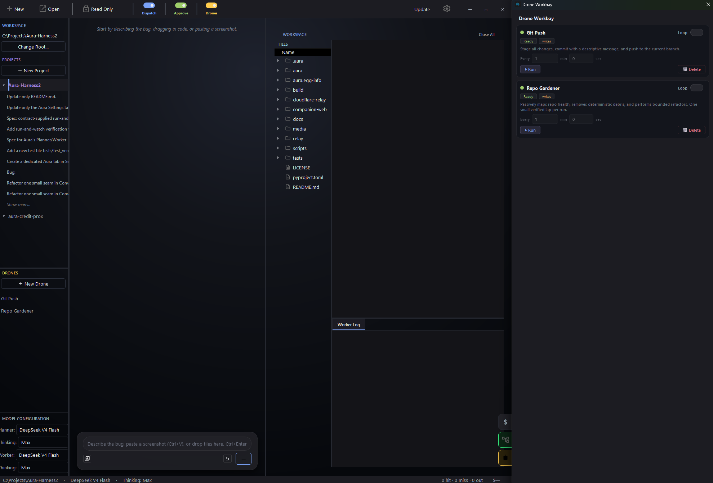
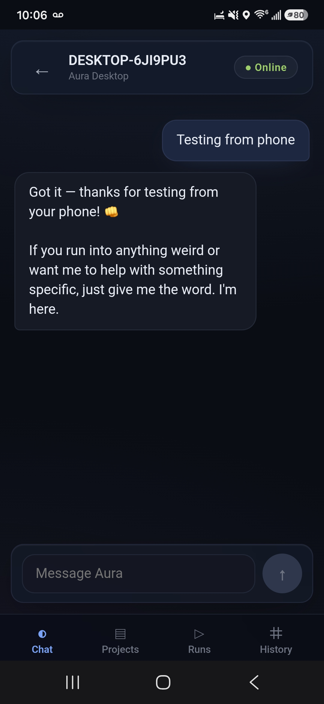

# Aura

[](https://www.python.org/)
[](LICENSE)
[]()
[]()

<p>
  <a href="https://www.producthunt.com/products/aura-ide?embed=true&utm_source=badge-featured&utm_medium=badge&utm_campaign=badge-aura-ide" target="_blank" rel="noopener noreferrer">
    
  </a>
</p>

**The AI workflow IDE where the model is the fuel and the harness is the engine.**

Aura is an open-source AI workflow IDE / coding harness. It is not just chat — it runs a Planner → Worker engineering loop. The Planner reads your repo and writes a technical spec. The Worker executes through controlled tools, proposes every change as a diff, and runs validation. You review before any write touches disk.

## Run it your way

**Bring your own keys** — DeepSeek, OpenAI, Anthropic, Gemini, OpenRouter. Set your API key in Settings; it's encrypted to disk.

**Aura Credits** — Use hosted Aura models without managing your own API keys. No credit card needed to start.
1. Settings → Aura → Buy Credits
2. Check Purchase
3. Select Aura as your Planner or Worker provider

## How it works

<p align="center">
  
</p>
<p align="center"><em>A full Planner → Worker cycle: spec writing, dispatch, code editing with diff approval, and auto-commit.</em></p>

The Planner reads your code, understands the project structure, and writes a technical spec. You see the spec. You can edit it. When you're satisfied, you dispatch it. The Worker executes the spec with read and write filesystem access, proposes every change as a diff for your approval, runs validation, and recovers if something breaks. Every write is backed up. Every batch of changes gets an AI-generated commit message. The whole cycle produces a receipt you can review.

What makes it different is the architecture. The Planner and Worker are two separate models that can run on different providers with different thinking depths. The Planner's output is a structured spec — not raw code — so the Worker starts from a clean target instead of inheriting the Planner's reasoning noise. Combined with a deterministic AST repo map and stable memory layers, this produces 90%+ prompt cache hit rates — not luck, architecture.

**Your agents, your workflows.** Drones are reusable workers you build from natural language. They show up in the main UI, run with one click, and can be dragged into Workbay: a visual canvas where you chain them into automations. Read-only drones run in parallel for safe background investigations. Write-capable drones follow the same diff-approval cycle as any Worker.

<p align="center">
  
</p>
<p align="center"><em>Drones in Workbay — reusable agents you can run, chain, and automate.</em></p>

<p align="center">
  
</p>
<p align="center"><em>Your Planner, from your phone. Chat, dispatch, watch it stream live on desktop.</em></p>

---

## What you get

**Planner/Worker architecture** — Two specialized agents. One plans, one executes. The spec is a token firewall between them. You review every dispatch before it runs. Mix a cheap Planner with an expensive Worker — the architecture abstracts the model.

**Diff approval on every write** — Every `write_file`, `edit_file`, or `edit_symbol` shows you a diff before touching disk. Approve, reject, approve all, or reject all. Existing files are backed up to `.aura/backups/` automatically.

**AST repo map and BM25 codebase search** — Every system prompt includes a structural map of your workspace built from Python AST parsing. The BM25 full-text index over 1,500 files gives the AI semantic search — not keyword grep — across 30+ file extensions.

**Validation and recovery** — After every change the Worker runs validation. If it fails, the Worker inspects the error and attempts a fix. If recovery fails, the change is aborted cleanly. No broken state left behind.

**Drones and Workbay** — Reusable AI workers you create from natural language and save per project. Run with one click, or chain them in the Workbay canvas for multi-step automations. Read-only drones are parallel-safe for background investigation. Write drones follow the same diff-approval cycle. The Planner can summon saved drones when it detects a match.

**Mobile companion** — A relay server lets you chat with your Planner from your phone. Dispatch specs remotely, watch the desktop stream the execution live. No separate app needed — works through your browser.

**Multi-provider model agnosticism** — DeepSeek, OpenAI, Anthropic, Gemini, OpenRouter — swap models and providers per session or per agent without changing anything else. Set different providers for Planner and Worker.

**Git integration** — Auto-commit with AI-generated messages, `/undo` to soft-reset the last commit, snapshot/restore for experimental checkpoints, automatic `.gitignore` setup.

**More** — Web research sub-agent (Tavily + BeautifulSoup), MCP tool integration for custom stdio servers, Windows installer with self-updater.

## Safety

- Every file write is presented as a diff for your approval before touching disk.
- Existing files are automatically backed up to `.aura/backups/` before any edit.
- Read-only mode prevents all writes — safe for exploration.
- API keys are encrypted to a machine-derived key before storage.
- `/undo` soft-resets the last commit. Git snapshot/restore provides experimental checkpoints.
- The Worker validates after every change and aborts cleanly if recovery fails.

---

## Built with Aura

Aura wrote most of itself. During May 2026 it processed **1.1 billion DeepSeek tokens** across nearly **30,000 API requests** while building its own codebase.

<p align="center">
  
</p>

The harness produces the quality, not the model. Swap models, swap providers, change thinking depth — the workflow stays the same and the output stays consistent.

---

## Quick start

**Windows** — Download the latest installer from [releases](https://github.com/CarpseDeam/Aura-IDE/releases). Per-user install, no admin rights needed. In-app updates handled automatically.

**From source** (all platforms):
```bash
git clone https://github.com/CarpseDeam/Aura-IDE.git
cd Aura-IDE
pip install .
aura
```

**First run:**
1. Open a workspace (File → Open Workspace).
2. Configure model access — set your own API key in Settings, or buy Aura Credits (Settings → Aura → Buy Credits).
3. Ask for something small — "fix a typo in README.md" or "add a docstring to this function."
4. Review the Planner's spec, then dispatch.
5. Approve or reject each diff the Worker proposes.

---

[Full documentation](docs/README.md) — getting-started guide, tool reference, provider config, and more.

[Aura blog](https://aura-ide.hashnode.dev/) — project updates, design deep-dives, usage guides

<p>
  <a href="https://www.producthunt.com/products/aura-ide?embed=true&utm_source=badge-featured&utm_medium=badge&utm_campaign=badge-aura-ide" target="_blank" rel="noopener noreferrer">
    
  </a>
  <a href="https://buymeacoffee.com/snowballkori" target="_blank" rel="noopener noreferrer">
    
  </a>
</p>

MIT License — see [LICENSE](LICENSE).
