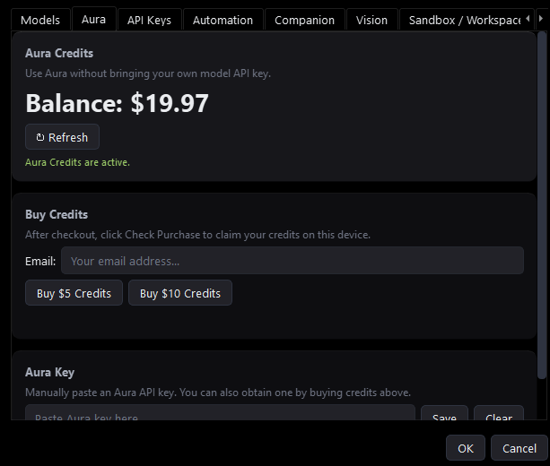
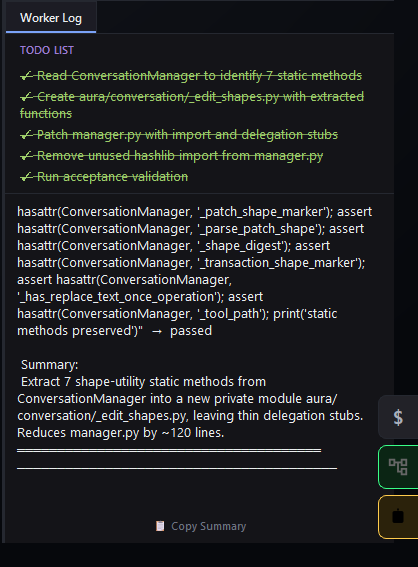
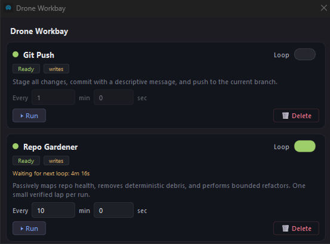
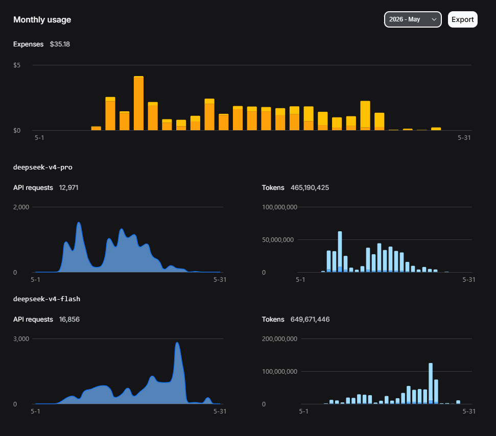
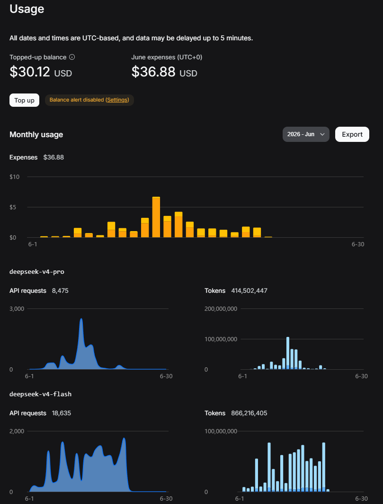

# Aura

[](https://www.python.org/)
[](LICENSE)
[]()
[]()

[](https://discord.gg/aGSthBX2Bg)

<p>
  <a href="https://www.producthunt.com/products/aura-ide?embed=true&utm_source=badge-featured&utm_medium=badge&utm_campaign=badge-aura-ide" target="_blank" rel="noopener noreferrer">
    
  </a>
</p>

**Aura IDE is an open-source, local-first AI coding harness for real repos. It plans changes, edits files, verifies work, and leaves receipts so developers can inspect what actually happened.**

[Start Here](https://aura-ide.hashnode.dev/start-here) · [Download](https://github.com/CarpseDeam/Aura-IDE/releases/latest) · [Discord](https://discord.gg/aGSthBX2Bg) · [Build Log](https://aura-ide.hashnode.dev/) · [Support](https://buymeacoffee.com/snowballkori)

## See it in action

<p align="center">
  
</p>
<p align="center"><em>Plan, dispatch, edit, review diffs, validate, and commit from one desktop workflow.</em></p>

## Quick start

**Windows:** Download the latest installer from [Releases](https://github.com/CarpseDeam/Aura-IDE/releases). Per-user install, no admin rights needed. In-app updates handled automatically.

**From source (all platforms):**
```bash
git clone https://github.com/CarpseDeam/Aura-IDE.git
cd Aura-IDE
pip install .
aura
```

**First run:**
1. Open a workspace (File → Open Workspace).
2. Choose your model path:
   - **Aura Credits:** Settings → Credits, buy credits ($5, $10, $20, $50 packs). Select Aura as Planner or Worker provider.
   - **BYOK:** Settings → API Keys. Add your key for DeepSeek, OpenAI, Anthropic, Gemini, or OpenRouter.
3. Ask for something small — "fix a typo in README.md" or "add a docstring to this function."
4. Review the Planner's spec, then click dispatch.
5. Approve or reject each diff the Worker proposes.
6. Watch validation run. Review the receipt.

## What Aura does

The workflow is a tight loop you stay in control of:

1. **Prompt** — Describe the change you want, in your own words.
2. **Planner spec** — The Planner reads your workspace (AST repo map, BM25 index, dependency graph) and writes a structured technical spec. You review and edit it before anything runs.
3. **Dispatch** — When the spec looks right, you dispatch it.
4. **Worker edits** — The Worker reads the spec and makes the changes through controlled file tools. It can read, write, edit, and search your codebase.
5. **Diff approval** — Every proposed write shows as a diff. You approve, reject, approve all, or reject all before anything touches disk.
<p align="left">
  
</p>
6. **Validation** — The Worker runs validation after every change. If it fails, the Worker inspects the error and attempts a fix. If recovery fails, the change is aborted cleanly. No broken state left behind.
7. **Commit** — Approved changes are committed with an AI-generated message. You get a receipt showing every tool call, token cost, and file changed.

The user reviews the plan before execution and reviews diffs before writes. Nothing is automatic unless you choose automation.

## Why Aura is different

Most AI coding tools are chat interfaces that try to edit files directly with no intermediate reasoning layer. Aura separates concerns:

**Planner and Worker are separate agents.** The Planner reads your codebase and produces a focused technical spec — not raw code. The Worker starts from that clean spec instead of inheriting the Planner's full reasoning trace. This means you can mix a cheap Planner with an expensive Worker, or use different providers per role.
<p align="left">
  
</p>
**Aura is a harness around models, not a model itself.** Swap DeepSeek for Anthropic mid-session, change thinking depth per agent, or switch providers entirely — the workflow stays the same. The architecture, not the model, produces the consistency.

**Repo-aware by default.** Every Planner system prompt includes an AST-derived structural map of your workspace. BM25 full-text search covers 30+ file extensions across up to 1,500 files. A dependency graph traces import relationships. The AI doesn't guess your project layout — it reads it.

**Verification is part of the loop.** Run-and-watch lets the Worker start a process (dev server, compiler, test watcher), observe its output over a window of seconds, and classify the outcome. Validation isn't bolted on — it's a tool the Worker uses like any other.

## Model access

Aura supports two model paths. Pick the one that fits you.

**Aura Credits** — hosted Aura models without managing provider keys. Open Settings → Credits, buy credits ($5, $10, $20, $50 packs available), then select Aura as your Planner or Worker provider. No credit card needed to start.
<p align="center">
  
</p>
**Bring Your Own Keys** — connect DeepSeek, OpenAI, Anthropic, Gemini, or OpenRouter directly. Set your API key in Settings; it's encrypted to disk with a machine-derived key. Environment variables also work (DEEPSEEK_API_KEY, OPENAI_API_KEY, etc.).

Both paths support the full Planner/Worker architecture. Mix them — use your own key for one role and Aura Credits for the other.

## Safety and control

Aura is designed around reviewable changes, not blind writes.

- **Diff approval on every write** — every write_file, edit_file, or edit_symbol shows a diff before touching disk. Approve, reject, approve all, or reject all.
- **Automatic backups** — existing files are backed up to `.aura/backups/` before any edit.
- **Read-only mode** — prevents all writes. Safe for exploration and investigation.
- **Validation and recovery** — every change is validated. The Worker retries on failure and aborts cleanly if recovery fails.
- **Git safety net** — snapshot/restore for experimental checkpoints, `/undo` to soft-reset the last commit, auto-generated commit messages.
- **Encrypted API keys** — stored with a hardware-derived key, not plaintext.

## Drones and Workbay

Drones are folder-backed project tools that handle repeatable tasks without re-explaining them every time. Each Drone lives in its own folder with a `drone.json` manifest and an entrypoint program. Drones are stored in Aura's global Drone roster and appear as cards in the Workbay.

**Command Drones** run a local entrypoint through json-stdio: Aura sends one JSON payload on stdin, the Drone processes it, and writes one JSON result to stdout. Any language works — Python, shell scripts, compiled binaries — as long as it reads stdin and writes JSON to stdout.

**Harness-lap Drones** (like Repo Gardener) run through Aura's Planner/Worker loop with guardrails: clean worktree, protected paths, max changed files, rollback on failure. Each lap is one bounded maintenance pass.

<p align="left">
  
</p>

**Write-policy** controls what a Drone can do:
- `read_only` — analysis only. No file modifications. Safe to run multiple in parallel.
- `normal_diff_approval` — changes files through the same diff-approval cycle as any Worker.
- `ask_before_writes` — per-action approval for sensitive operations.

**Read-only Drones** run in parallel (up to 3 at once) for safe background investigation. **Write-capable Drones** use a shared write lane and run exclusively.

**Workbay** is where saved Drones appear as cards. From each card you can:
- **Run** — start one Drone run.
- **Loop** — repeat the Drone on a timer until stopped. Each lap is one bounded run.
- **Delete** — remove the Drone from the roster (deletes the folder).
- See live status: running, completed, failed, or waiting for the next loop lap.

Every run produces a **receipt** — the Drone's JSON output plus run metadata — saved to `.aura/drones/runs/` so you can review past work without re-running.

Examples you can use or build in minutes:
- **Git Push Drone** — stage all, commit with a descriptive message, push.
- **File Size Mapper** — scan the workspace for large files, report top offenders.
- **Repo Gardener** — passive maintenance pass with harness-lap guardrails. Removes deterministic debris, applies bounded refactors, and rolls back on failure.

<p align="center">
  
</p>
<p align="center"><em>Drones in Workbay — reusable automation cards you can run, loop, and delete.</em></p>

## Advanced capabilities

- **AST repo map** — structural workspace map built from Python AST parsing. Every Planner system prompt includes it.
- **Dependency graph** — import-tree traversal for blast radius analysis. Know what breaks before you change it.
- **BM25 codebase search** — full-text semantic search across 30+ file extensions and up to 1,500 files. Powers the `search_codebase` tool.
- **Run-and-watch verification** — the Worker can start a process (dev server, compiler, watcher), observe output over a configurable window, and classify the result.
- **Git integration** — status, diff, commit, undo, snapshot/restore, automatic `.gitignore` setup.
- **Mobile companion** — relay server lets you chat with your Planner from your phone. Dispatch specs remotely, watch the desktop stream execution live. No separate app needed — works through your browser.
- **Web research** — built-in sub-agent using Tavily + BeautifulSoup for live web lookups during planning.
- **MCP tool integration** — connect custom stdio MCP servers. Tools are converted to OpenAI-compatible function schemas automatically.
- **Self-updater** — Windows builds check for updates and install in-place. Git-based updates for source installs.

## Built with Aura

Aura wrote most of itself. During May/June 2026 it processed **2+ billion DeepSeek tokens** across nearly **30,000 API requests** while building its own codebase.

<p align="center">
  
</p>
<p align="center">
  
</p>

The harness produces the quality, not the model. Swap models, swap providers, change thinking depth — the workflow stays the same and the output stays consistent.

---

[Full documentation](docs/README.md) — getting-started guide, tool reference, provider config, and more.

[Aura blog](https://aura-ide.hashnode.dev/) — project updates, design deep-dives, usage guides

[Discord](https://discord.gg/aGSthBX2Bg) — help, bug reports, feedback, and show-and-tell

Aura is free and open source. Support helps keep development moving.

<p>
  <a href="https://www.producthunt.com/products/aura-ide?embed=true&utm_source=badge-featured&utm_medium=badge&utm_campaign=badge-aura-ide" target="_blank" rel="noopener noreferrer">
    
  </a>
  <a href="https://buymeacoffee.com/snowballkori" target="_blank" rel="noopener noreferrer">
    
  </a>
</p>

MIT License — see [LICENSE](LICENSE).
