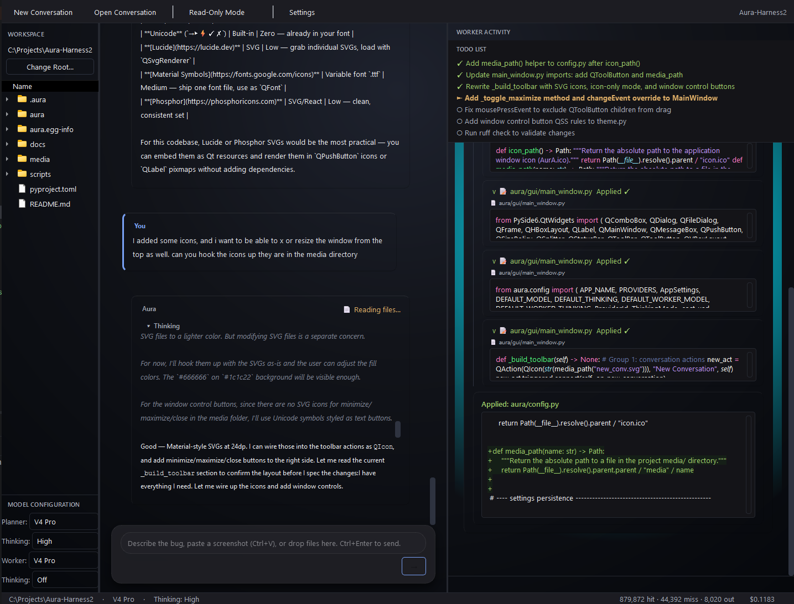

# Aura

[](https://www.python.org/)
[](LICENSE)
[]()


**Desktop AI Orchestration IDE — pair programming with full workspace awareness.**

Aura is a desktop chat application that helps you troubleshoot and modify your codebase. You chat with an AI agent that can read your project files, search your codebase, propose code changes, and — when you approve — apply those changes directly to disk. It supports **DeepSeek**, **OpenAI**, **Anthropic**, **Google Gemini**, and **OpenRouter** as AI backends, with a local [Ollama](https://ollama.com/) vision model for screenshot preprocessing.

Built with [PySide6](https://pypi.org/project/PySide6/) (Qt for Python).

<p align="center">
  <video src="https://github.com/CarpseDeam/Aura-Harness2/raw/master/media/Aura-Working.mp4" width="100%" controls>
    Your browser does not support the video tag. <a href="https://github.com/CarpseDeam/Aura-Harness2/raw/master/media/Aura-Working.mp4">Download demo</a>
  </video>
</p>

<p align="center"><em>Demo: A full Planner → Worker cycle — spec writing, dispatch, code editing with diff approval, and auto-commit.</em></p>

---

## Table of Contents

- [Screenshots](#screenshots)
- [Key Features](#key-features)
- [Supported Providers](#supported-providers)
- [Installation](#installation)
- [Usage](#usage)
- [Configuration](#configuration)
- [Architecture](#architecture)
- [Project Structure](#project-structure)
- [Development](#development)
- [Dependencies](#dependencies)
- [License](#license)

---

## Screenshots

<p align="center">
  
  
</p>

*Left: Main interface with three-pane layout — workspace tree, chat view, and worker activity panel. Right: Diff approval dialog — every file change is reviewed before being applied.*

---

## Key Features

### Planner / Worker Architecture

A two-agent system inspired by pair programming. The **Planner** reads your codebase, reasons about the change, asks clarifying questions, and writes a precise technical specification. The **Worker** executes that specification with read/write filesystem access, subject to your approval. Both agents can be assigned different models and reasoning depths from the same provider.

### Multi-Provider Support

Choose between **DeepSeek**, **OpenAI**, **Anthropic**, **Google Gemini**, or **OpenRouter** as your AI provider. Each provider exposes multiple models with independent pricing. The Planner and Worker can use different models — for example, a fast model for the Planner and a more capable model for the Worker. See [Supported Providers](#supported-providers) for details.

### Filesystem Tools

The AI has direct, sandboxed access to your workspace. All file paths are validated against the workspace root — the AI cannot escape the project directory.

| Category | Tools | Description |
|----------|-------|-------------|
| **Read** | `read_file`, `list_directory`, `glob`, `read_file_outline`, `grep_search`, `find_usages` | Explore the codebase — read files, list directories, find files by pattern, extract structural outlines via AST, search text with regex, and find all usages of a symbol |
| **Write** | `write_file`, `edit_file` | Create or replace files; surgically replace code blocks with fuzzy matching |
| **Git** | `git_status`, `git_diff` | Inspect working tree state, review staged or unstaged changes |
| **Web** | `web_search`, `web_fetch` | Search the web and fetch page content (used by the research sub-agent) |
| **Terminal** | `run_terminal_command` | Run linters, test suites, type checkers, or installers with live-streamed output |
| **Worker** | `update_todo_list` | Worker-only: maintains a live progress tracker shown to the user |
| **Dispatch** | `dispatch_to_worker` | Planner-only: hands off a spec to the Worker for execution |

The conversation loop includes a **circuit breaker** that detects when the same tool call produces the identical failure output three or more times consecutively. In such cases, a warning is injected into the tool result to alert the AI that it is likely in a loop, preventing infinite retry cycles.

### Safe File Editing with Backups

Every `write_file` or `edit_file` call triggers a **diff approval dialog** before any bytes touch disk. You can **Approve**, **Reject**, **Approve All** (approve this and all subsequent writes in this turn), or **Reject All** (reject this and all further writes). Before any write, existing files are automatically backed up to `.aura/backups/<ISO-timestamp>/<relative-path>` in your workspace.

### Read-Only Mode

Toggle a toolbar button to lock out all write tools. The AI can still read, search, and advise, but cannot modify code. Safe for exploration and code review.

### Web Research Agent

`run_research` dispatches a background sub-agent that autonomously searches the web and scrapes pages to produce a synthesized report. Ideal for looking up documentation, debugging unfamiliar errors, or researching libraries.

### Terminal Commands

`run_terminal_command` executes shell commands in your workspace directory with real-time output streaming. Run linters (`ruff check .`), type checkers (`mypy .`), test suites (`pytest`), or package installers. The AI is instructed to run validation commands after making code changes.

### Vision Preprocessing

Paste screenshots (`Ctrl+V`) or drag-and-drop images into the chat. The input panel handles both clipboard paste and file drag-and-drop. A local [Ollama](https://ollama.com/) vision model (`llama3.2-vision`) describes them in detail so the AI can reason about visual content — error dialogs, UI glitches, diagrams, and more.

### Git Integration

If your workspace is a git repository, Aura provides deep integration:

- **Auto-commit** — After the Worker completes a set of file changes, Aura stages and commits them with an AI-generated message derived from the dispatch goal and worker summary.
- **`/undo` command** — Soft-resets `HEAD~1`, reverting the last commit while keeping changes in the working directory.
- **`git_status`** and **`git_diff`** tools — Both the Planner and Worker can inspect repository state before and after changes, review diffs, and verify what was modified.

### Worker TODO List

The Worker agent uses `update_todo_list` to maintain a live progress tracker with `pending` → `active` → `done` statuses. This list is displayed prominently in the Worker Activity panel, giving you real-time visibility into what the Worker is doing and what remains.

### Conversation Persistence

Chats are saved to `.aura/conversations/` in your workspace as JSON. Restore your last session on launch, open past conversations from the toolbar, or start fresh at any time.

### Session Cost Tracking

A live status bar shows token usage (cache hit, cache miss, output tokens) and estimated cost in USD. Pricing is tracked per-model using the rates embedded in `aura/config.py`.

### Thinking Modes

Choose **Off**, **High**, or **Max** reasoning depth independently for the Planner and Worker. Higher thinking modes let the model spend more compute on reasoning before responding — useful for complex architectural decisions or tricky bugs.

### Custom System Prompts

Configure separate system prompts for Single mode, the Planner, and the Worker via the Settings dialog. Tailor each agent's behavior, style, and constraints to your workflow.

### Separate Worker Temperature

The Worker has its own temperature setting (default 0.1) separate from the Planner / Single mode (default 0.7). This makes the Worker more deterministic and consistent when applying code changes, while the Planner can remain more creative when reasoning about architecture. Both temperatures are configurable in Settings.

---

## Supported Providers

Aura supports five AI providers. You choose one per session via the toolbar dropdown, then select any model from that provider's catalogue that the app exposes. The Planner and Worker always use the same provider but can be assigned different models and thinking modes.

| Provider | Base URL | Env Var |
|----------|----------|---------|
| **DeepSeek** | `https://api.deepseek.com` | `DEEPSEEK_API_KEY` |
| **OpenAI** | `https://api.openai.com/v1` | `OPENAI_API_KEY` |
| **Google Gemini** | `https://generativelanguage.googleapis.com/v1beta/openai/` | `GEMINI_API_KEY` |
| **Anthropic** | `https://api.anthropic.com/v1` | `ANTHROPIC_API_KEY` |
| **OpenRouter** | `https://openrouter.ai/api/v1` | `OPENROUTER_API_KEY` |

> **Tip:** Model availability and pricing change frequently. The app embeds a current model catalogue and pricing table that you can inspect in `aura/config.py`. For the latest pricing, refer to each provider's official documentation.

---

## Installation

### Prerequisites

- **Python 3.10** or later
- An API key for at least one supported provider (see [API Key Setup](#api-key-setup))
- (Optional) [Ollama](https://ollama.com/) running locally with `llama3.2-vision` for screenshot preprocessing
- (Optional) [Git](https://git-scm.com/) for auto-commit and `/undo` support

### Install via pip

```bash
pip install -e .
```

Or, once published:

```bash
pip install aura
```

### API Key Setup

Aura never stores API keys in its config file — keys are read exclusively from environment variables.

**DeepSeek:**
```bash
export DEEPSEEK_API_KEY="sk-..."
```

**OpenAI:**
```bash
export OPENAI_API_KEY="sk-..."
```

**Anthropic:**
```bash
export ANTHROPIC_API_KEY="sk-ant-..."
```

**Google Gemini:**
```bash
export GEMINI_API_KEY="..."
```

**OpenRouter:**
```bash
export OPENROUTER_API_KEY="sk-or-..."
```

On Windows, set these via **System Properties → Environment Variables**.

### Launch

```bash
aura
```

Or:

```bash
python -m aura
```

---

## Usage

### Basic Workflow

1. Launch Aura and select your project folder as the workspace root (or it defaults to the current directory).
2. Type a question or request in the input panel — describe a bug, ask for an explanation, or request a change.
3. The **Planner** reads relevant files, asks clarifying questions if needed, then writes a spec and calls `dispatch_to_worker`.
4. A **Spec Card** appears in the chat. Review it (you can edit the spec if needed), then click **Dispatch**.
5. The **Worker** runs, reads the target files, and proposes edits. Each write pops up a diff dialog for your approval.
6. When the Worker finishes, it reports a summary back to the Planner, and the conversation continues.

### Keyboard Shortcuts

| Shortcut | Action |
|----------|--------|
| **Ctrl+Enter** | Send message |
| **Ctrl+V** (in editor) | Paste image from clipboard |

### Slash Commands

| Command | Description |
|---------|-------------|
| `/undo` | Soft-resets the last git commit (if your workspace is a git repo). Use this to quickly revert the AI's last change. |

### Model, Thinking & Provider Selection

Use the dropdowns in the input panel to configure:

- **Provider** — DeepSeek, OpenAI, Anthropic, Google Gemini, or OpenRouter
- **Planner Model** — Reads code and writes specs
- **Planner Thinking** — Reasoning depth (Off / High / Max)
- **Worker Model** — Executes file edits
- **Worker Thinking** — Reasoning depth for the worker

The Planner and Worker always use the same provider, but can be assigned different models and thinking modes from that provider's catalogue.

### Attachments

- **Paste images** (`Ctrl+V`) — screenshots of errors, UI, or diagrams are sent through vision preprocessing
- **Drag-and-drop files** — images get base64-encoded and described by the vision model; other files are attached as path references

---

## Configuration

Settings are stored at `~/.config/Aura/config.json` (or the platform-appropriate equivalent via [platformdirs](https://pypi.org/project/platformdirs/)). Open the **Settings** dialog via the toolbar gear icon to configure:

| Setting | Description |
|---------|-------------|
| **Provider** | Select the AI provider (DeepSeek / OpenAI / Anthropic / Google Gemini / OpenRouter) |
| **API Key Status** | Shows whether the required environment variable is set (green = found, red = missing) |
| **Default Model** | Model used in Single mode |
| **Default Thinking** | Reasoning depth for Single mode |
| **Planner/Worker Mode** | Toggle the two-agent architecture on or off |
| **Planner Model** | Model assigned to the Planner |
| **Planner Thinking** | Reasoning depth for the Planner |
| **Worker Model** | Model assigned to the Worker |
| **Worker Thinking** | Reasoning depth for the Worker |
| **Temperature** | Sampling temperature (0.0–2.0) |
| **Worker Temperature** | Sampling temperature for the worker (0.0–2.0). Default: 0.1 (more deterministic than the planner) |
| **System Prompt** | Custom system prompt for Single mode |
| **Planner System Prompt** | Custom system prompt for the Planner agent |
| **Worker System Prompt** | Custom system prompt for the Worker agent |
| **Vision Enabled** | Toggle screenshot preprocessing via Ollama |
| **Vision Model** | Ollama model name (default: `llama3.2-vision`) |
| **Vision Endpoint** | Ollama API endpoint (default: `http://localhost:11434/v1`) |
| **Restore Last Conversation** | Automatically reload the previous session on launch |

> **Security note:** API keys are **never** written to `config.json`. They are read exclusively from environment variables at runtime.

---

## Architecture

Aura uses a decoupled architecture with Qt signals/slots bridging synchronous AI conversation logic to the async GUI:

```
┌──────────────┐     ┌──────────────┐     ┌──────────────────┐
│   GUI Layer  │ ←→  │ Bridge Layer │ ←→  │ Conversation     │
│  (PySide6)   │     │ (QThread)    │     │ Layer (sync)     │
│              │     │              │     │                  │
│ MainWindow   │     │ ConvBridge   │     │ ConvManager      │
│ ChatView     │     │ _Worker      │     │ History          │
│ InputPanel   │     │ _ApproveProxy│     │ ToolRegistry     │
│ WorkspaceTree│     │ _DispatchProxy│    │ Persistence      │
│ WorkerWindow │     │              │     │                  │
└──────────────┘     └──────────────┘     └──────────────────┘
```

- **GUI Layer** — PySide6 widgets: main window, chat transcript, input composer, workspace tree, diff dialogs, settings, and the worker activity panel.
- **Bridge Layer** — Runs the synchronous conversation loop on a background `QThread`. Proxies tool approvals and dispatch decisions back to the GUI via signals/slots so the UI never blocks.
- **Conversation Layer** — Pure Python, synchronous: manages message history, the tool-calling loop, tool execution via the `ToolRegistry`, and conversation persistence.

Detailed architecture documentation is coming soon.

---

## Project Structure

```
aura/
├── __init__.py              # Package version
├── __main__.py              # Entry point
├── config.py                # Settings, provider registry, pricing, paths
├── git.py                   # Auto-commit & /undo
├── vision.py                # Ollama vision client
├── bridge/                  # Qt thread bridge
│   ├── __init__.py
│   └── qt_bridge.py         # ConversationBridge, _Worker, _DispatchProxy
├── client/                  # AI provider client
│   ├── __init__.py
│   ├── deepseek.py          # OpenAI-compatible client (all providers)
│   └── events.py            # Streaming event types
├── conversation/            # Synchronous conversation logic
│   ├── __init__.py
│   ├── manager.py           # ConversationManager (tool loop)
│   ├── history.py           # Message history
│   ├── dispatch.py          # Worker dispatch types
│   ├── persistence.py       # Save/load conversations
│   └── tools/               # Tool implementations
│       ├── __init__.py
│       ├── registry.py      # ToolRegistry & tool definitions
│       ├── fs_read.py       # read_file, list_directory, glob, read_file_outline
│       ├── fs_write.py      # write_file, edit_file
│       ├── grep.py          # grep_search
│       ├── find_usages.py   # find_usages (symbol-aware search)
│       ├── git_tools.py     # git_status, git_diff
│       ├── web.py           # web_search, web_fetch
│       └── backup.py        # Timestamped backups before writes
└── gui/                     # PySide6 UI components
    ├── __init__.py
    ├── main_window.py       # MainWindow, toolbar, status bar
    ├── chat_view.py         # Chat transcript with cards
    ├── input_panel.py       # Message composer, attachments
    ├── workspace_tree.py    # File tree browser
    ├── worker_window.py     # Worker progress viewer
    ├── planner_log.py       # Planner reasoning log viewer
    ├── diff_dialog.py       # Diff approval modal
    ├── spec_edit_dialog.py  # Spec editor before dispatch
    ├── settings_dialog.py   # Settings dialog
    ├── theme.py             # Dark theme constants
    ├── aura_widget.py       # Animated "Aura" dots
    ├── controllers.py       # Controller logic
    ├── markdown_renderer.py # Markdown rendering
    ├── syntax.py            # Syntax highlighting support
    └── cards/               # Chat message card widgets
        ├── __init__.py
        ├── _collapsible.py
        ├── _helpers.py
        ├── _stream_label.py
        ├── assistant_card.py
        ├── code_block_card.py
        ├── code_writer_card.py
        ├── diff_card.py
        ├── error_card.py
        ├── spec_card.py
        ├── terminal_card.py
        ├── tool_call_card.py
        └── user_card.py
```

---

## Development

### Dev Install

```bash
git clone <repo-url>
cd aura
pip install -e .
```

### Smoke Tests

The `scripts/` directory contains smoke tests that exercise individual subsystems. Most require `DEEPSEEK_API_KEY` to be set.

| Script | What It Tests |
|--------|---------------|
| `smoke_client.py` | DeepSeek API client connectivity and streaming |
| `smoke_conversation.py` | Full conversation loop with tool calls |
| `smoke_gui.py` | GUI launch and basic widget initialization |
| `smoke_history.py` | Message history management |
| `smoke_planner_worker.py` | Planner → Worker dispatch flow |
| `smoke_tools.py` | Tool registry and individual tool execution |
| `smoke_vision.py` | Vision preprocessing with Ollama |
| `smoke_research.py` | Web research sub-agent |

Run a smoke test:

```bash
python scripts/smoke_client.py
```

### Requirements

- Python 3.10+
- A DeepSeek API key for most smoke tests
- Ollama with `llama3.2-vision` for `smoke_vision.py`

---

## Dependencies

| Package | Purpose |
|---------|---------|
| [PySide6](https://pypi.org/project/PySide6/) | Qt for Python GUI |
| [openai](https://pypi.org/project/openai/) | AI provider client (OpenAI-compatible endpoint used by all providers) |
| [pydantic](https://pypi.org/project/pydantic/) | Data validation |
| [platformdirs](https://pypi.org/project/platformdirs/) | Cross-platform config/data directories |
| [Pillow](https://pypi.org/project/Pillow/) | Image handling for pasted screenshots |
| [Pygments](https://pypi.org/project/Pygments/) | Syntax highlighting in diff dialogs |
| [httpx](https://pypi.org/project/httpx/) | HTTP client for web research |
| [ddgs](https://pypi.org/project/ddgs/) | Web search for research |
| [beautifulsoup4](https://pypi.org/project/beautifulsoup4/) | HTML parsing for web research |

---

## License

Aura is released under the [MIT License](LICENSE).

The application icon is located at [`media/AurA.ico`](media/AurA.ico).
